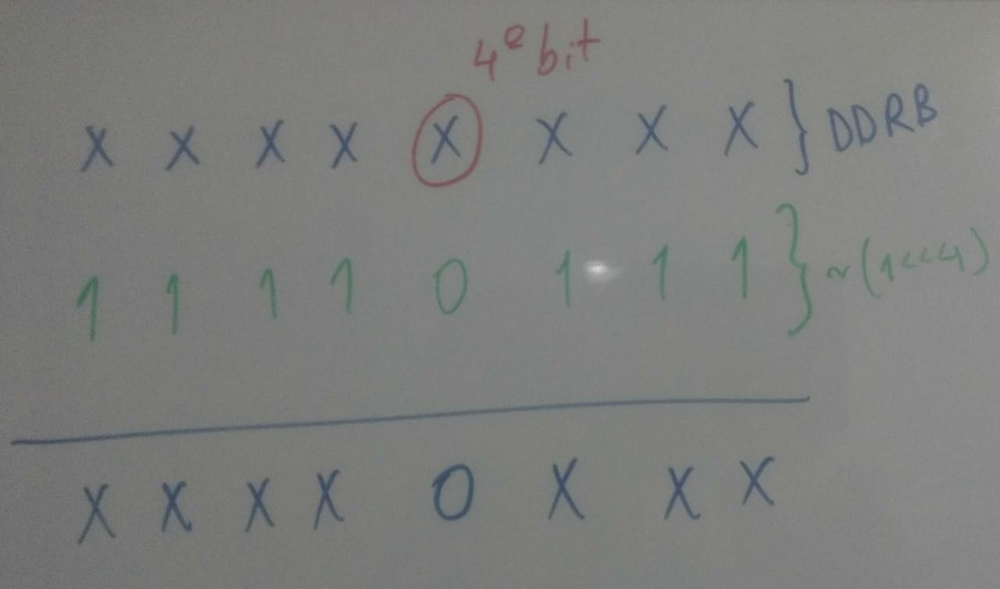
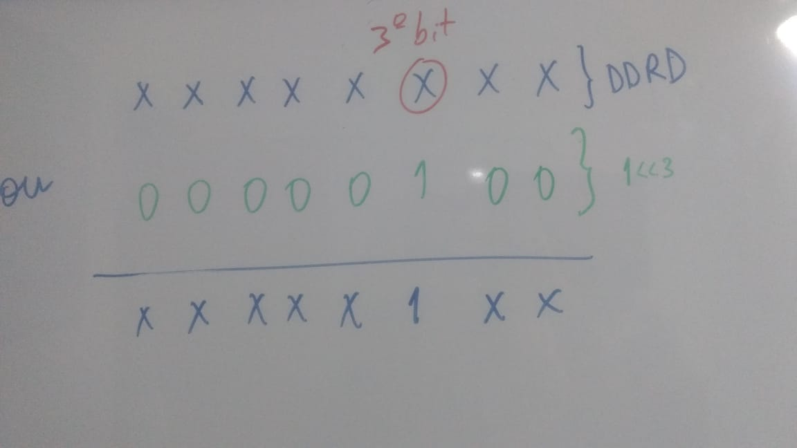
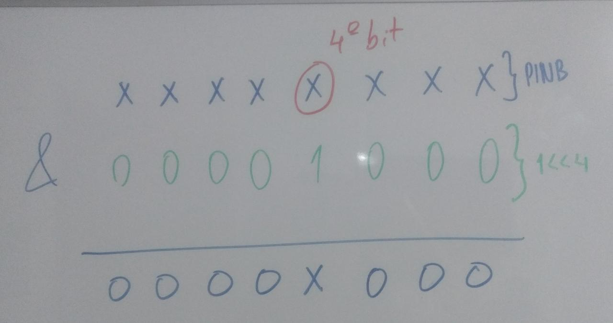

## Notificações

### Acesso direto as portas GPIO (entrada e saída)
Conforme requisitado no enunciado do trabalho, a aplicação faz acesso direto às portas GPIO. A tabela a seguir apresenta os trechos de código que acessam diretamente às portas GPIO, assim como uma pequena explciação desse acesso e o código equivalente utilizando as funções `pinMode` e `digitalRead`.

|original|acesso direto às portas GPIO| explicação |
|-|-|-|
|`pinMode(TOUCH_SENSOR, INPUT);` |`DDRB &= ~(1 << 4);` | O sensor de touch está conectado a porta 12 (valor de `TOUCH_SENSOR`) do Arduino, que, segundo o "Arduino Uno Pinout Diagram", corresponde ao pino 4 da porta B. Cada porta possui 3 registradores, o DDRx, PORTx e PINx. Nesse caso, é necessário alterar somente o registrador DDRB, confirgurando seu quarto bit como 0, o que indica que o quarto pino da porta D é de entrada. |
|`pinMode(LED_R,OUTPUT);`| <code>DDRD &&#124;= 1 << 3;`</code> | Sabendo-se que `LED_R` é igual à 3 e que essa porta do Arduino corresponde ao pino 3 da porta D (segundo o "Arduino Uno Pinout Diagram"), basta configurar o terceiro bit do registrador DDRD como 1. |
|`pinMode(LED_G,OUTPUT);`| <code>DDRD &&#124;= 1 << 4;`</code>  | Análogo ao anterior |
|`pinMode(LED_B,OUTPUT);`| <code>DDRD &&#124;= 1 << 5;`</code>  | Análogo ao anterior |
|`int touchSensor = digitalRead(TOUCH_SENSOR);`| `int touchSensor = PINB & (1 << 4);`| O sensor touch está conectado ao pino 4 da porta B. Para pinos de entrada, o valor ser lido fica armazenado no registrador PIN. Para ler a posição 4 do registrador, foi necessário setar os os bits das demais posições para 0.  |

### Links
- https://www.macrumors.com/review/dotti-notti-iphone-controlled-smart-lights/

